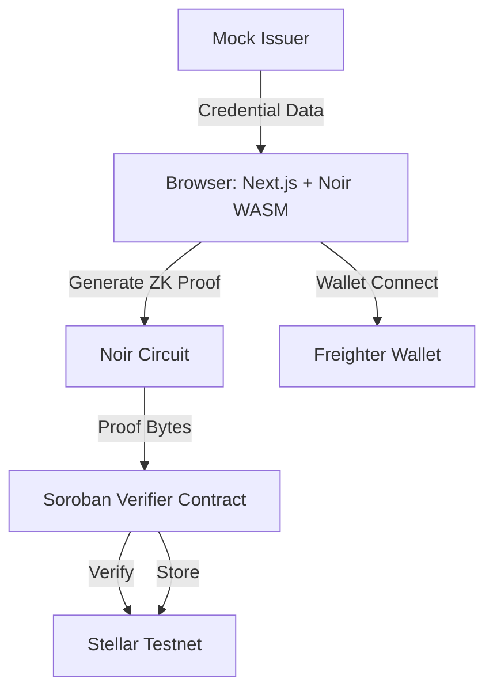

# Zethia — Prove Everything. Reveal Nothing.

<div align="center">
  
  
  **Zero-knowledge credentials for Stellar DeFi**
  
  [](https://stellar.org)
  [](https://soroban.stellar.org)
  [](https://noir-lang.org)
  [](https://dorahacks.io/hackathon/stellar-hacks-zk)
</div>

---

## What is Zethia?

Zethia lets you prove things about yourself without revealing the underlying data.

- **Prove your credit score is above 650** — without showing your actual score
- **Prove you passed KYC** — without sharing your passport again
- **Prove you're over 18** — without revealing your birth date

All proofs are verified **on-chain** via Soroban smart contracts on Stellar. Zero-knowledge cryptography ensures your private data stays private.

## Demo Flow

1. **Connect** your Freighter wallet (Stellar testnet)
2. **Select** a credential (e.g., "Credit Score > 650")
3. **Generate** a ZK proof in your browser (Noir WASM)
4. **Submit** the proof to the Soroban verifier contract
5. **Get approved** — the lending protocol trusts the proof, not your data

## Architecture



See [docs/architecture.md](docs/architecture.md) for full C4 diagrams.

## Tech Stack

| Layer | Technology |
|-------|-----------|
| Frontend | Next.js 15, React 19, Tailwind CSS v4, TypeScript |
| ZK Circuits | Noir DSL (compiled to WASM for browser-side proving) |
| Smart Contracts | Soroban SDK (Rust, deployed to Stellar Testnet) |
| Wallet | Freighter Browser Extension |
| Blockchain | Stellar Testnet (Soroban RPC) |

## Project Structure

```
zethia/
├── circuits/noir/          # ZK circuits (Noir DSL)
│   ├── src/main.nr         # Credit score threshold proof
│   ├── Nargo.toml
│   └── Prover.toml
├── contracts/soroban/      # Soroban smart contracts
│   └── verifier/
│       ├── src/lib.rs      # Proof verifier contract
│       └── Cargo.toml
├── src/
│   ├── app/                # Next.js pages
│   │   ├── page.tsx         # Landing page
│   │   ├── dashboard/       # Wallet + credential dashboard
│   │   ├── proof/           # Proof generation page
│   │   └── demo/            # End-to-end lending demo
│   ├── components/
│   │   ├── credentials/     # CredentialCard
│   │   ├── wallet/          # WalletConnect (Freighter)
│   │   └── ui/              # Button, Card, Modal, Toast
│   └── lib/
│       ├── stellar.ts       # Stellar SDK client
│       ├── noir.ts          # Noir WASM proof generation
│       ├── soroban.ts       # Soroban RPC + contract calls
│       └── credentials.ts   # Credential types + mock data
└── docs/
    ├── prd.md              # Product requirements
    ├── architecture.md     # C4 architecture diagrams
    └── tasks.md            # Implementation task breakdown
```

## Getting Started

### Prerequisites

- Node.js 20+
- Freighter browser extension (for Stellar testnet)
- Stellar testnet account (get XLM from [testnet faucet](https://laboratory.stellar.org/#account-creator))

### Install

```bash
git clone https://github.com/MystiqueMide/zethia
cd zethia
npm install
cp .env.example .env  # or create .env with testnet RPC
npm run dev
```

Open [http://localhost:3000](http://localhost:3000).

### Build Noir Circuits (WSL/Linux only)

```bash
cd circuits/noir
nargo compile
nargo execute
```

### Build Soroban Contract (WSL/Linux only)

```bash
cd contracts/soroban/verifier
cargo build --target wasm32-unknown-unknown --release
soroban contract deploy \
  --wasm target/wasm32-unknown-unknown/release/zethia_verifier.wasm \
  --source <YOUR_STELLAR_SECRET_KEY> \
  --network testnet
```

## Environment Variables

| Variable | Description | Default |
|----------|-------------|---------|
| `NEXT_PUBLIC_STELLAR_NETWORK` | Stellar network | `testnet` |
| `NEXT_PUBLIC_SOROBAN_RPC_URL` | Soroban RPC endpoint | `https://soroban-testnet.stellar.org` |
| `NEXT_PUBLIC_STELLAR_PASSPHRASE` | Network passphrase | Testnet passphrase |

## Sponsor Technology

Zethia was built for **Stellar Hacks: Real-World ZK** and uses:

- **Stellar Testnet** — blockchain network for decentralized verification
- **Soroban** — smart contract platform that verifies ZK proofs on-chain
- **Noir** — zero-knowledge circuit language from Aztec (compiled to WASM)
- **RISC Zero** — general-purpose ZK virtual machine (supported toolchain)
- **Freighter** — Stellar wallet for testnet interaction

## License

MIT — Built for Stellar Hacks: Real-World ZK 2026
