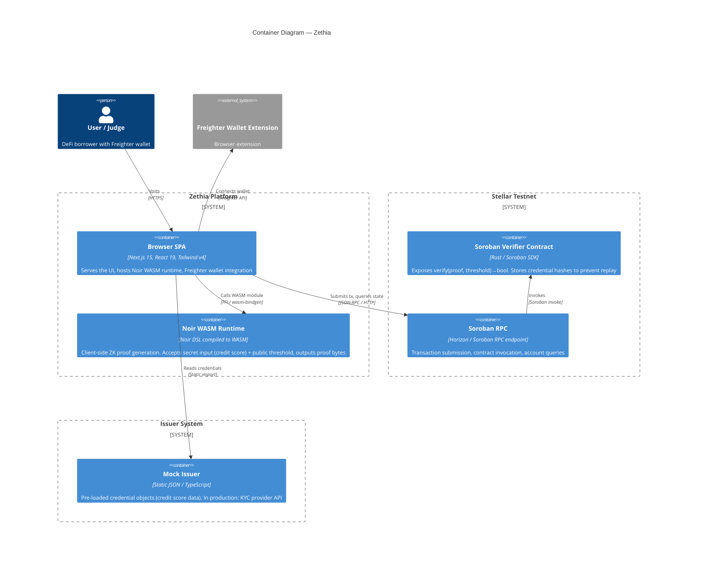
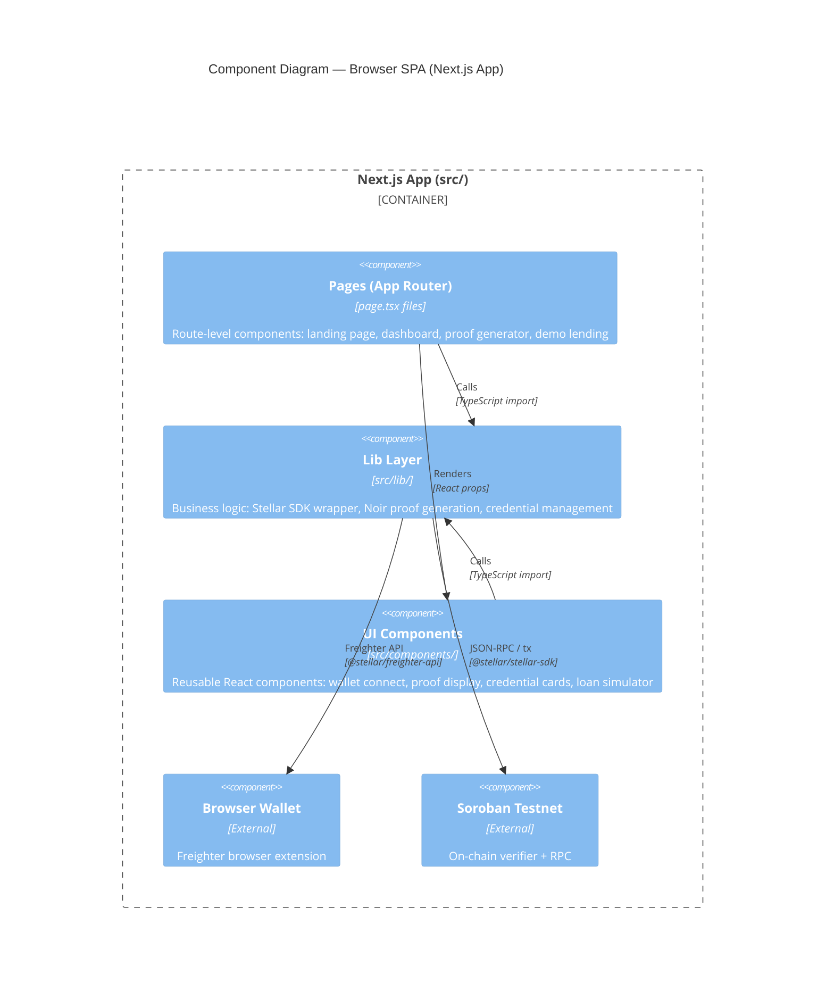
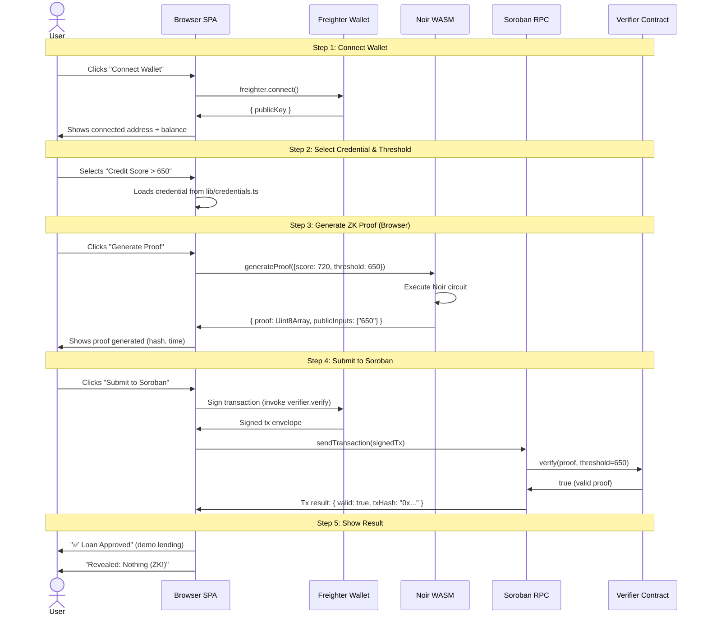

# Zethia — C4 Architecture

> **Last updated**: 2026-06-24  
> **Status**: Architecture as designed — matches current implementation state

---

## Table of Contents

1. [C4 Level 1 — System Context](#c4-level-1--system-context)
2. [C4 Level 2 — Containers](#c4-level-2--containers)
3. [C4 Level 3 — Components (Next.js App)](#c4-level-3--components-nextjs-app)
4. [Data Flow](#data-flow)
5. [Dependency Map](#dependency-map)
6. [Key Interfaces Between Components](#key-interfaces-between-components)
7. [File Map](#file-map)

---

## C4 Level 1 — System Context

*(From `docs/prd.md` — reproduced here for reference)*

```
                      +--------------+
                      |   Stellar    |
                      |   Testnet    |
                      | (Soroban)    |
                      +------+-------+
                             | verify proof
                      +------v-------+
   +-----+    proof   |   Zethia     |   issue credential   +----------+
   |User +----------->+  Web App     +<---------------------+  Issuer  |
   +-----+            | (Next.js)    |                       |  (mock)  |
                      +------+-------+
                             |
                      +------v-------+
                      |  ZK Circuit  |
                      |    (Noir)    |
                      |  -> WASM     |
                      +--------------+
```

- **User**: DeFi borrower or hackathon judge with a Freighter wallet. Connects wallet, generates ZK proofs in-browser, submits proofs on-chain.
- **Zethia Web App**: Next.js 15 SPA. Hosts the ZK proof generator (Noir compiled to WASM), wallet connect UI, credential dashboard, and demo lending simulator.
- **Stellar Testnet (Soroban)**: On-chain verification. The Soroban verifier contract receives proof bytes + threshold, returns `true`/`false`.
- **ZK Circuit (Noir → WASM)**: Compiled Noir circuit embedded in the browser. Generates zero-knowledge proofs client-side — no server involved.
- **Issuer (Mock)**: A simulated credential issuer that "signs" credentials (off-chain mock data). In production this would be a KYC provider issuing verifiable credentials. For the hackathon, credentials are pre-loaded mock objects.

---

## C4 Level 2 — Containers



### Container Descriptions

| # | Container | Technology | Responsibility |
|---|-----------|------------|----------------|
| 1 | **Browser SPA** | Next.js 15, React 19, Tailwind v4, TypeScript | User-facing UI: landing page, wallet connect, credential dashboard, proof generator, demo lending simulator. Runs entirely client-side after initial SSR. |
| 2 | **Noir WASM Runtime** | Noir DSL → `nargo compile --target wasm` | Loaded into the browser as a WebAssembly module. Receives secret input (credit score) and public threshold from the UI, executes the ZK circuit, returns proof bytes + public inputs. No server round-trip needed. |
| 3 | **Soroban Verifier Contract** | Rust (`soroban-sdk`), Stellar Testnet | On-chain ZK proof verification. Stores verified credential hashes to prevent replay attacks. Exposes `verify(proof: BytesN<...>, threshold: u32) -> bool`. |
| 4 | **Soroban RPC** | Stellar Testnet infrastructure | The network gateway. The browser SPA communicates with it via `@stellar/stellar-sdk` to deploy/query contracts and submit signed transactions. |
| 5 | **Mock Issuer** | Static TypeScript data in `src/lib/credentials.ts` | Provides pre-seeded credential objects (e.g., `{ type: "credit_score", score: 720, issuer: "MockBank" }`). Simulates what a KYC provider would issue in production. |
| 6 | **Freighter Wallet Extension** | Freighter browser extension (`@stellar/freighter-api`) | Holds the user's Stellar testnet keys. Signs transactions before they are submitted to the network. |

---

## C4 Level 3 — Components (Next.js App)



### Page Components (`src/app/`)

| Route | File | Responsibility | Key Dependencies |
|-------|------|----------------|------------------|
| `/` | `src/app/page.tsx` | Landing page: Hero, Features, CTA sections | `components/landing/*` |
| `/dashboard` | `src/app/dashboard/page.tsx` | Connected user's credential dashboard. Shows credential cards, wallet status, "Generate Proof" entry points | `lib/credentials.ts`, `lib/stellar.ts`, `components/credentials/CredentialCard`, `components/web3/WalletConnect` |
| `/proof` | `src/app/proof/page.tsx` | Proof generator screen. Takes credential + threshold → generates proof → submits to Soroban → displays result | `lib/noir.ts`, `lib/stellar.ts`, `lib/credentials.ts`, `components/credentials/ProofGenerator` |
| `/demo` | `src/app/demo/page.tsx` | Demo lending protocol integration. "Apply for Loan" button → triggers full flow → "Approved"/"Denied" | `lib/stellar.ts`, `lib/noir.ts`, `components/demo/LoanSimulator` |

### Lib Layer (`src/lib/`)

| Module | File | Responsibility | Public API |
|--------|------|----------------|------------|
| **Stellar Client** | `src/lib/stellar.ts` | Wallet connection (Freighter), testnet initialization, Soroban contract invocation helper | `connectWallet(): Promise<WalletState>`<br>`disconnectWallet(): void`<br>`getBalance(address: string): Promise<string>`<br>`invokeContract(method, args): Promise<TxResult>` |
| **Noir Proof Runner** | `src/lib/noir.ts` | Loads Noir WASM module, runs circuit with inputs, returns proof bytes | `initNoir(): Promise<void>`<br>`generateProof(inputs: CircuitInputs): Promise<ProofResult>`<br>`verifyProof(proof: Uint8Array): Promise<boolean>` |
| **Credentials Manager** | `src/lib/credentials.ts` | Manages credential objects, formats for UI, tracks proof history | `getCredentials(): Credential[]`<br>`getCredentialById(id: string): Credential`<br>`recordProof(credentialId, txHash, isValid): void` |
| **Soroban Contract ABI** | `src/lib/soroban.ts` | Contract address, method selectors, argument encoding | `VERIFIER_CONTRACT_ID: string`<br>`buildVerificationArgs(proof, threshold): xdr.ScVal[]`<br>`parseVerificationResult(scVal): boolean` |
| **Demo Data** | `src/lib/demo-data.ts` | Pre-seeded demo data for hackathon judges | `demoUser: UserProfile`<br>`demoCredentials: Credential[]`<br>`isDemoMode: boolean` |
| **Utilities** | `src/lib/utils.ts` | `cn()` for Tailwind class merging | `cn(...inputs: ClassValue[]): string` |

### UI Components (`src/components/`)

| Component | File | Responsibility | Props / Interface |
|-----------|------|----------------|-------------------|
| **WalletConnect** | `src/components/web3/WalletConnect.tsx` | "Connect Freighter" button, address display, balance display, disconnect | `onConnect?: (address: string) => void`<br>`onDisconnect?: () => void` |
| **ProofDisplay** | `src/components/credentials/ProofDisplay.tsx` | Shows proof generation status, proof hash, verification result, Stellar tx link | `proof: ProofResult`<br>`status: 'generating' \| 'ready' \| 'submitting' \| 'verified' \| 'failed'` |
| **CredentialCard** | `src/components/credentials/CredentialCard.tsx` | Single credential card: type, issuer, score (hidden — ZK!), "Prove" button | `credential: Credential`<br>`onGenerateProof: (credential) => void` |
| **LoanSimulator** | `src/components/demo/LoanSimulator.tsx` | Full demo lending flow: loan form, credential requirement display, approval/denial result | `onComplete: (result: LoanResult) => void` |
| **Hero** | `src/components/landing/hero.tsx` | Landing page hero section: tagline, glowing hexagon, CTA button | _(static — no props)_ |
| **Features** | `src/components/landing/features.tsx` | 3-step "How It Works" cards: Connect → Prove → Verify | _(static — no props)_ |
| **CTA** | `src/components/landing/cta.tsx` | Landing page bottom CTA → `/demo` | _(static — no props)_ |
| **Nav** | `src/components/layout/nav.tsx` | Top navigation bar with wallet connect + nav links | _(reads wallet state from context)_ |
| **Footer** | `src/components/layout/footer.tsx` | Site footer with links | _(static — no props)_ |

### UI Primitives (`src/components/ui/`)

Reusable design-system components used across the app:

| Component | File | Notes |
|-----------|------|-------|
| **Button** | `src/components/ui/button.tsx` | Variants: primary, ghost, outline, size sm/md/lg |
| **Card** | `src/components/ui/card.tsx` | Card, CardHeader, CardTitle, CardDescription, CardContent, CardFooter |
| **Modal** | `src/components/ui/modal.tsx` | Dialog overlay for proof details / transaction confirmation |
| **Toast** | `src/components/ui/toast.tsx` | Toast notification system + ToastProvider context |
| **Skeleton** | `src/components/ui/skeleton.tsx` | Loading placeholder for credential cards / proof generation |

---

## Data Flow

### Primary Flow: Prove Credit Score > Threshold



### Key Data Transformations

| Step | Input | Output | Where |
|------|-------|--------|-------|
| Wallet Connect | User click | `{ publicKey, network }` | `lib/stellar.ts` via `@stellar/freighter-api` |
| Credential Selection | Click on card | `Credential { type, score, issuer }` | `lib/credentials.ts` → UI state |
| Proof Generation | `{ score: 720, threshold: 650 }` | `{ proof: Uint8Array, publicInputs: ["650"] }` | `lib/noir.ts` ← Noir WASM |
| Contract Invocation | `(proof, threshold)` | `soroban_sdk::Val` (bool) | `lib/stellar.ts` → RPC → Contract |
| Result Display | `TxResult { valid, txHash }` | UI component state | `ProofDisplay.tsx` / `LoanSimulator.tsx` |

---

## Dependency Map

```
                         +-----------------+
                         |    Pages        |
                         | (App Router)    |
                         | src/app/**      |
                         +---+----+----+---+
                             |    |    |
              +--------------+    |    +---------------+
              |                   |                    |
              v                   v                    v
   +----------+--------+ +-------+--------+ +---------+----------+
   |  Landing Components | | Proof / Demo    | |  Layout Components |
   |  (hero, features,   | | Components      | |  (nav, footer)     |
   |   cta)              | | (ProofGenerator,| +--------------------+
   +--------------------+ |  LoanSimulator,  |
                           |  CredentialCard)|
                           +---+----+----+---+
                               |    |    |
                               v    v    v
                      +--------+----+----+--------+
                      |          Lib Layer         |
                      |  src/lib/                  |
                      |                            |
                      |  stellar.ts ──────────────> @stellar/stellar-sdk
                      |                        └──> @stellar/freighter-api
                      |                            |
                      |  noir.ts ─────────────────> Noir WASM module
                      |                            |
                      |  credentials.ts ──────────> (self-contained)
                      |                            |
                      |  soroban.ts ──────────────> @stellar/stellar-sdk
                      |                            |
                      |  demo-data.ts ────────────> (self-contained)
                      |                            |
                      |  utils.ts ────────────────> clsx, tailwind-merge
                      +-----------------------------+
                                   |
                                   v
                      +-----------------------------+
                      |     External Dependencies   |
                      |                             |
                      |  Noir Circuit (WASM)        |
                      |  Soroban Verifier Contract  |
                      |  Stellar Testnet RPC        |
                      |  Freighter Wallet Extension |
                      +-----------------------------+
```

### Dependency Rules

1. **Pages import Components and Lib** — Pages never import other pages.
2. **Components import Lib** — Components never import pages or other component categories (e.g., `credentials/*` does not import `demo/*`).
3. **Lib modules import external packages and each other** — `stellar.ts` imports `soroban.ts` for contract-specific helpers. `stellar.ts` and `noir.ts` are independent of each other.
4. **UI primitives (`src/components/ui/`)** are dependency-free — they only import `lib/utils.ts` for the `cn()` helper.
5. **No circular dependencies** — The import graph is a DAG.

---

## Key Interfaces Between Components

### 1. Wallet State Interface (`lib/stellar.ts` → Components)

```typescript
// lib/stellar.ts
interface WalletState {
  connected: boolean;
  publicKey: string | null;
  network: "TESTNET" | "FUTURENET";
}

function connectWallet(): Promise<WalletState>;
function disconnectWallet(): void;
function getBalance(address: string): Promise<string>;
```

**Consumed by**: `WalletConnect.tsx`, `Nav.tsx`, all pages that require a connected wallet.

### 2. Proof Generation Interface (`lib/noir.ts` → Components)

```typescript
// lib/noir.ts
interface CircuitInputs {
  score: number;      // Hidden (private) input
  threshold: number;  // Public input — this is the only thing revealed on-chain
}

interface ProofResult {
  proof: Uint8Array;           // ZK proof bytes
  publicInputs: string[];      // [threshold.toString()]
  proofHash: string;           // hex-encoded hash for display
  generationTimeMs: number;    // performance metric for UI
}

function initNoir(): Promise<void>;
function generateProof(inputs: CircuitInputs): Promise<ProofResult>;
```

**Consumed by**: `ProofGenerator.tsx`, `LoanSimulator.tsx`.

### 3. Credential Interface (`lib/credentials.ts` → Components)

```typescript
// lib/credentials.ts
interface Credential {
  id: string;
  type: "credit_score";
  label: string;              // e.g., "Credit Score Credential"
  issuer: string;             // e.g., "MockBank"
  score: number;              // Actual score (HIDDEN from chain)
  issuedAt: string;           // ISO-8601
}

function getCredentials(): Credential[];
function getCredentialById(id: string): Credential | undefined;
```

**Consumed by**: `CredentialCard.tsx`, `dashboard/page.tsx`, `proof/page.tsx`.

### 4. Contract Verification Interface (`lib/stellar.ts` → Soroban RPC)

```typescript
// lib/stellar.ts (contract-specific helpers in lib/soroban.ts)
interface VerificationRequest {
  proof: Uint8Array;
  threshold: number;
}

interface TxResult {
  valid: boolean;
  txHash: string;
  stellarExpertUrl: string;  // Link to block explorer
}

function invokeVerifier(req: VerificationRequest): Promise<TxResult>;
```

**Consumed by**: `ProofGenerator.tsx`, `LoanSimulator.tsx`.

### 5. Demo Loan Interface (`components/demo/LoanSimulator.tsx`)

```typescript
// components/demo/LoanSimulator.tsx
interface LoanApplication {
  amount: number;       // Mock loan amount (XLM)
  duration: number;     // Days
  requiredCredential: {
    type: "credit_score";
    threshold: number;
  };
}

interface LoanResult {
  approved: boolean;
  message: string;
  revealed: string[];   // Always ["Nothing — ZK!"] for demo
  txHash?: string;      // Present if approved (on-chain verification occurred)
}
```

---

## File Map

```
zethia/
├── circuits/
│   └── noir/
│       ├── Nargo.toml              # Noir project manifest
│       └── src/
│           └── main.nr             # Credit score threshold circuit
│
├── contracts/
│   └── soroban/
│       └── verifier/
│           ├── Cargo.toml          # Soroban Rust project manifest
│           └── src/
│               └── lib.rs          # Verifier contract: verify(proof, threshold) → bool
│
├── src/
│   ├── app/
│   │   ├── layout.tsx              # Root layout: Nav, Footer, ToastProvider
│   │   ├── globals.css             # Tailwind v4 global styles (dark theme)
│   │   ├── page.tsx                # Landing page: / (Hero → Features → CTA)
│   │   ├── dashboard/
│   │   │   └── page.tsx            # Dashboard: /dashboard (wallet + credentials)
│   │   ├── proof/
│   │   │   └── page.tsx            # Proof generator: /proof
│   │   └── demo/
│   │       └── page.tsx            # Demo lending: /demo
│   │
│   ├── components/
│   │   ├── web3/
│   │   │   └── WalletConnect.tsx   # Freighter connect/disconnect button
│   │   ├── credentials/
│   │   │   ├── CredentialCard.tsx  # Single credential card with "Prove" button
│   │   │   ├── ProofDisplay.tsx    # Proof hash, status, verification result
│   │   │   └── ProofGenerator.tsx  # Full proof gen flow (input → WASM → submit)
│   │   ├── demo/
│   │   │   └── LoanSimulator.tsx   # Mock lending: apply → prove → approved/denied
│   │   ├── landing/
│   │   │   ├── hero.tsx            # "Prove Everything. Reveal Nothing." hero
│   │   │   ├── features.tsx        # 3-step "Connect → Prove → Verify" cards
│   │   │   └── cta.tsx             # "Try Demo" call-to-action
│   │   ├── layout/
│   │   │   ├── nav.tsx             # Top navigation bar
│   │   │   └── footer.tsx          # Site footer
│   │   └── ui/
│   │       ├── button.tsx          # Button primitive (variants, sizes)
│   │       ├── card.tsx            # Card primitive (header, content, footer)
│   │       ├── modal.tsx           # Modal/dialog primitive
│   │       ├── toast.tsx           # Toast notification system
│   │       └── skeleton.tsx        # Skeleton loading placeholder
│   │
│   └── lib/
│       ├── stellar.ts              # Wallet connect, balance, contract invocation
│       ├── soroban.ts              # Contract ABI, address, argument encoding
│       ├── noir.ts                 # Noir WASM loader + proof generation
│       ├── credentials.ts          # Credential objects + proof history
│       ├── demo-data.ts            # Pre-seeded demo data for judges
│       └── utils.ts                # cn() / Tailwind class merging
│
├── public/
│   └── circuits/
│       └── credit_score.wasm       # Compiled Noir circuit (output of T1)
│
├── docs/
│   ├── prd.md                      # Product requirements document
│   ├── tasks.md                    # Implementation tasks + build order
│   └── architecture.md             # This file
│
├── package.json                    # Next.js 15, React 19, Stellar SDK, Tailwind v4
├── tsconfig.json                   # TypeScript config with @/* path alias
├── next.config.ts                  # Next.js config
└── README.md                       # Project README (T9)
```
